# 展示 #

# 项目简介 #
本项目是应用市场的一个示例项目，展示了一个应用市场基本的功能：应用展示，应用分类，应用详情，应用下载等。

# 学习目标 #
* 自上而下的代码抽取
* 网络框架Retrofit使用及其缓存处理
* 多线程下载
* 社会化分享

# 服务器搭建 #
* 文件说明
	* GooglePlayServer:java ee工程,我们的服务器
	* GooglePlayServer.war:java ee工程的war包形式
	* WebInfos:资源文件

* 搭建方式:
 	* 源码形式.
		1. 用java ee 版eclipse导入工程GooglePlayServer.
		2. 修改目录下system.properties为`dir=C:\\Users\\Leon\\Desktop\\GooglePlay\\server`(`WebInfos`所在的目录),需要注意要么用"/"或者"\\"
		3. 部署java ee工程到tomcat,然后运行
		4. 在pc和手机上分别验证。

	* war包方式:
		1. 把war放到tomact的webapps目录下面就可以,然后启动tomcat会自动解压war包.
		2. 启动tomcat,自动解压war包,并运行程序 
		3. 修改`webapps\GooglePlayServer\WEB-INF\classes`目录下system.properties为`dir=C:\\Users\\Leon\\Desktop\\GooglePlay\\server`(`WebInfos`所在的目录),需要注意要么用"/"或者"\\"
		4. 在pc和手机上分别验证 
		5. `注意:tomcat必须使用7以上版本`

# 项目初始化 #
* BaseActivity
* [ButterKnife](https://github.com/JakeWharton/butterknife)集成
* Git初始化

# 侧滑菜单 #

## 布局 ##

	<?xml version="1.0" encoding="utf-8"?>
	<android.support.v4.widget.DrawerLayout
	    android:id="@+id/drawer_layout"
	    xmlns:android="http://schemas.android.com/apk/res/android"
	    android:layout_width="match_parent"
	    android:layout_height="match_parent"
	    android:fitsSystemWindows="true"
	    xmlns:app="http://schemas.android.com/apk/res-auto">
	
	    <!-- Content -->
	    <include layout="@layout/main_content"/>
	    <!-- Drawer -->
	    <android.support.design.widget.NavigationView
	        android:id="@+id/navigation"
	        android:layout_width="wrap_content"
	        android:layout_height="match_parent"
	        android:layout_gravity="start"
	        app:headerLayout="@layout/drawer_header"
	        app:menu="@menu/drawer_main"/>
	
	</android.support.v4.widget.DrawerLayout>

## DrawLayout ##
在DrawerLayout出现之前，我们需要做侧滑菜单时，不得不自己实现一个或者使用Github上的开源的项目SlidingMenu，也许是Google也看到了SlidingMenu的强大之处，于是在Android的后期版本中添加了DrawerLayout来实现SlidingMenu同样功能的组件，而且为了兼容早期版本，将其添加在android,support.v4包下。

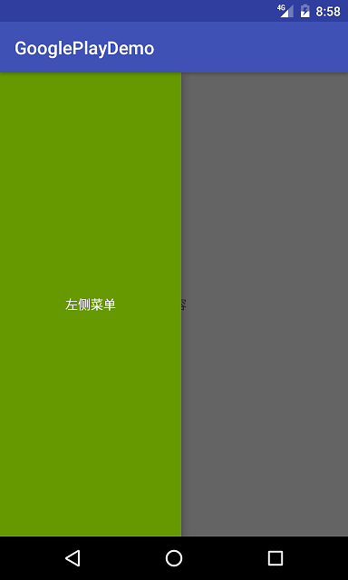  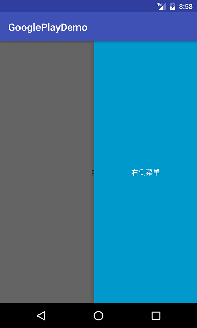

### 布局 ###
	<?xml version="1.0" encoding="utf-8"?>
	<android.support.v4.widget.DrawerLayout
	    android:id="@+id/drawer_layout"
	    xmlns:android="http://schemas.android.com/apk/res/android"
	    android:layout_width="match_parent"
	    android:layout_height="match_parent">
	
	    <TextView
	        android:id="@+id/content"
	        android:layout_width="match_parent"
	        android:layout_height="match_parent"
	        android:gravity="center"
	        android:text="内容"/>
	
	    <TextView
	        android:id="@+id/left"
	        android:layout_width="200dp"
	        android:layout_height="match_parent"
	        android:layout_gravity="start"
	        android:textColor="@android:color/white"
	        android:text="左侧菜单"
	        android:gravity="center"
	        android:background="@android:color/holo_green_dark"/>
	
	    <TextView
	        android:id="@+id/right"
	        android:layout_width="200dp"
	        android:layout_height="match_parent"
	        android:layout_gravity="end"
	        android:text="右侧菜单"
	        android:gravity="center"
	        android:textColor="@android:color/white"
	        android:background="@android:color/holo_blue_dark"/>
	
	</android.support.v4.widget.DrawerLayout>

>使用layout_gravity属性来控制是左侧还是右侧菜单

## NavigationView ##

### NavigationView的使用 ###
DrawerLayout里面的菜单布局我们可以自己定义，但谷歌也提供的相应的控件NavigationView，方便开发者完成菜单布局。

	//需添加依赖	
	compile 'com.android.support:design:25.1.0'

>app:headerLayout="@layout/drawer_header" 定义菜单的头布局
>
>app:menu="@menu/drawer_main" 定义菜单选项

### 设置菜单点击监听 ###
    mNavigationView.setNavigationItemSelectedListener(new NavigationView.OnNavigationItemSelectedListener() {
        @Override
        public boolean onNavigationItemSelected(@NonNull MenuItem item) {
            mDrawerLayout.closeDrawer(GravityCompat.START);//关闭左侧菜单
            mNavigationView.setCheckedItem(item.getItemId());
            return false;
        }
    });

## ActionBar ##
### 介绍
* Action Bar 是Google 在Android 3.0之后推出的一种全新用户操作方式
* 目的是用来替换掉菜单按键功能，长按操作功能，提供一种全新的操作体验
* 统一界面，方便开发

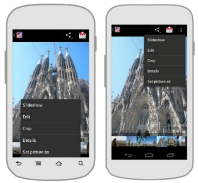

### ActionBar 4大部分

#### 1.App标题图片 ####
包含了 图标，主标题，副标题，回退部分
#### 2.视图控件 ####
允许用户切换视图。视图切换控件的样式有`下拉菜单`或`选项卡`控件,对应了`标准`，`list`，`tab`,3种导航模式，默认为标准。

* list模式

	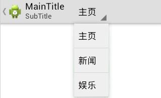
* tab模式

	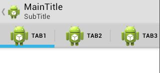

#### 3.操作按钮 
在操作栏里，展示出你的 app 中最重要的操作。不能展示在操作栏里的操作，可以自动移到“更多操作”里

#### 4.更多操作 ####
把不常用的操作放到更多操作里

### 如何支持actionbar?
1. android sdk 3.0之后默认支持actionBar
2. 市面上也有开源的actionbarSherlock可以支持ActionBar
3. google 2013 i/o大会.在v7(api level 7_android2.1以上)中对actionbar进行了兼容;

####3.0之前版本和3.0之后版本####
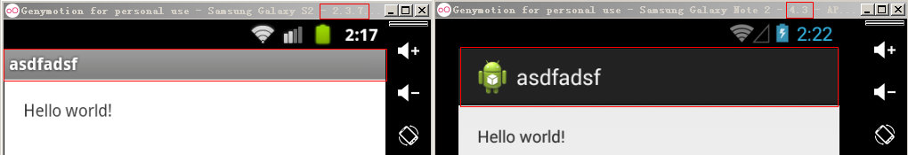

### ActionBar基本使用
	mActionBar = getSupportActionBar();	// 获取ActionBar

	mActionBar.setTitle("MainTitle");// 设置主title部分
	mActionBar.setSubtitle("SubTitle");// 设置子title部分
	mActionBar.setDisplayShowTitleEnabled(true);// 设置菜单 标题是否可见

	mActionBar.setIcon(R.drawable.ic_launcher);// 设置应用图标
	mActionBar.setLogo(R.drawable.ic_launcher);// 设置Logo
	mActionBar.setDisplayShowHomeEnabled(true);// 设置应用图标是否可见
	mActionBar.setDisplayUseLogoEnabled(false);// 设置是否显示Logo优先

	mActionBar.setDisplayHomeAsUpEnabled(true);// 设置back按钮是否可见

### ActionBar和DrawerLayout联动
    private void initActionBar() {
        ActionBar supportActionBar = getSupportActionBar();
        //显示返回按钮
        supportActionBar.setDisplayHomeAsUpEnabled(true);
        //创建ActionBarDrawerToggle
        mActionBarDrawerToggle = new ActionBarDrawerToggle(this, mDrawerLayout, R.string.open, R.string.close);
        //同步DrawerLayout的开关状态，如果DrawerLayout是关闭的则显示抽屉图片，如果是打开的则显示返回图片
        mActionBarDrawerToggle.syncState();
        //监听DrawerLayout的开关状态, 触发动画
        mDrawerLayout.addDrawerListener(mActionBarDrawerToggle);
    }

    /**
     * 处理ActionBarDrawerToggle的点击事件
     */
    @Override
    public boolean onOptionsItemSelected(MenuItem item) {
        switch (item.getItemId()) {
            case android.R.id.home:
                mActionBarDrawerToggle.onOptionsItemSelected(item);
                break;
        }
        return super.onOptionsItemSelected(item);
    }

## ToolBar ##
官方在某些程度上认为 ActionBar 限制了 android app 的开发与设计的弹性,
Toolbar 是在 Android 5.0 开始推出的一个 Material Design 风格的导航控件 ，Google 非常推荐大家使用 Toolbar 
来作为Android客户端的导航栏，以此来取代之前的 Actionbar 。与 Actionbar 相比，Toolbar 明显要灵活的多。它不像 
Actionbar一样，一定要固定在Activity的顶部，而是可以放到界面的任意位置。ToolBar继承ViewGroup，内部可以摆放孩子，方便定制。

### Toolbar使用 ###
#### 1. 将主题改为NoActionBar ####

	

#### 3. 配置状态栏颜色与Toolbar背景色一致 ####
    <item name="colorPrimaryDark">@color/colorPrimary</item>

# 主界面 #
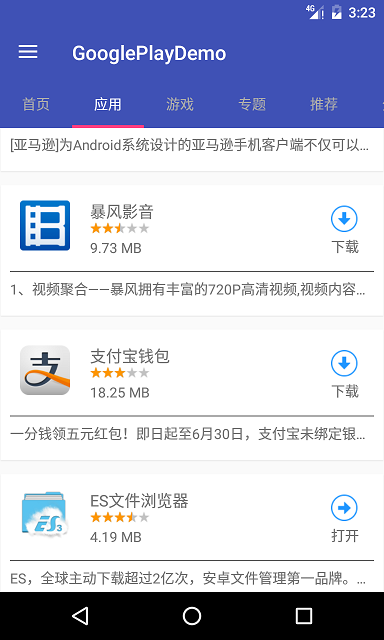
## 布局 ##
	<!--main_content.xml-->
	<?xml version="1.0" encoding="utf-8"?>
	<LinearLayout
	    xmlns:android="http://schemas.android.com/apk/res/android"
	    xmlns:app="http://schemas.android.com/apk/res-auto"
	    android:layout_width="match_parent"
	    android:layout_height="match_parent"
	    android:orientation="vertical">
	
	    <android.support.v7.widget.Toolbar
	        android:id="@+id/tool_bar"
	        android:layout_width="match_parent"
	        android:layout_height="?attr/actionBarSize"
	        android:background="@color/colorPrimary"
	        app:theme="@style/ThemeOverlay.AppCompat.Dark.ActionBar">
	    </android.support.v7.widget.Toolbar>
	
	    <android.support.design.widget.TabLayout
	        android:id="@+id/tab_layout"
	        android:layout_width="match_parent"
	        android:layout_height="48dip"
	        app:tabBackground="@color/colorPrimary"
	        app:tabIndicatorColor="@color/colorAccent"
	        app:tabIndicatorHeight="3dp"
	        app:tabMode="scrollable"
	        app:tabSelectedTextColor="@android:color/white"
	        app:tabTextColor="@android:color/darker_gray"/>
	
	    <android.support.v4.view.ViewPager
	        android:id="@+id/vp"
	        android:layout_width="match_parent"
	        android:layout_height="match_parent">
	    </android.support.v4.view.ViewPager>
	
	</LinearLayout>

## 初始化布局 ##
    private void initView() {
        mVp.setAdapter(new MainPagerAdapter(getResources().getStringArray(R.array.main_titles), getSupportFragmentManager()));
        mTabLayout.setupWithViewPager(mVp);
    }

	public class MainPagerAdapter extends FragmentPagerAdapter {
	
	    private String[] mTitles;
	
	    public MainPagerAdapter(String[] titles, FragmentManager fragmentManager) {
	        super(fragmentManager);
	        mTitles = titles;
	    }
	
	    @Override
	    public Fragment getItem(int position) {
	        return FragmentFactory.getInstance().getFragment(position);
	    }
	
	    @Override
	    public int getCount() {
	        return mTitles.length;
	    }
	
	    @Override
	    public CharSequence getPageTitle(int position) {
	        return mTitles[position];
	    }
	}

## FragmentPagerAdapter和FragmentStatePagerAdapter的区别
### FragmentPagerAdapter ###
* 该类内的每一个生成的 Fragment 都将保存在内存之中，因此适用于那些相对静态的页，数量也比较少的那种；如果需要处理有很多页，并且数据动态性较大、占用内存较多的情况，应该使用FragmentStatePagerAdapter
* 现象：每个位置getItem(position)只走一次
### FragmentStatePagerAdapter ###
* 当页面离开视线后，就会被消除，释放其资源；而在页面需要显示时，生成新的页面。这么实现的好处就是当拥有大量的页面时，不必消耗大量的内存。
* 现象：每个位置getItem(position)可能走多次

## BaseFragment抽取 ##
BaseFragment抽取了所有Fragment的共性，特性交给子类去实现。
### 共性 ###
#### 布局 ####
* 加载进度条
* 加载出错布局

#### 加载成功 ####
    protected void onDataLoadedSuccess() {
        mLoadingProgress.setVisibility(View.GONE);
        mLoadingError.setVisibility(View.GONE);
        mBaseView.addView(onCreateContentView());
    }

#### 加载失败 ####
    protected void onDataLoadedError() {
        mLoadingError.setVisibility(View.VISIBLE);
        mLoadingProgress.setVisibility(View.GONE);
    }

### 特性 ###
#### 加载数据 ####
    /**
     * 子类去实现自己的数据加载
     */
    protected abstract void startLoadData();

#### 创建视图 ####
    /**
     * 子类必须实现该方法提供内容的视图
     */
    protected abstract View onCreateContentView();

# Retrofit集成 #
* [Github](https://github.com/square/retrofit)
* [Wiki](http://square.github.io/retrofit/)

## 添加依赖 ##
    compile 'com.squareup.retrofit2:retrofit:2.1.0'
    compile 'com.squareup.retrofit2:converter-gson:2.1.0'

## 创建Api接口 ##
	public interface Api {
	    @GET("hot")
	    Call<List<String>> listHot();
	}

## 初始化Api接口 ##
    private HeiMaRetrofit(){
        Retrofit retrofit = new Retrofit.Builder()
                .baseUrl(Constant.HOST)
                .build();
        mApi = retrofit.create(Api.class);
    }

    public static HeiMaRetrofit getInstance() {
        if (sHeiMaRetrofit == null) {
            synchronized (HeiMaRetrofit.class) {
                if (sHeiMaRetrofit == null) {
                    sHeiMaRetrofit = new HeiMaRetrofit();
                }
            }
        }
        return sHeiMaRetrofit;
    }

## 配置JSON转换 ##
    private static Gson gson = new GsonBuilder()
            .setLenient()
            .create();

    Retrofit retrofit = new Retrofit.Builder()
            .addConverterFactory(GsonConverterFactory.create(gson))
            .build();
# 热门页面 #
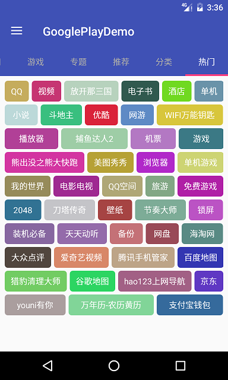
## 加载数据 ##
    @Override
    protected void startLoadData() {
        Call<List<String>> listCall = HeiMaRetrofit.getInstance().getApi().listHot();
        listCall.enqueue(new Callback<List<String>>() {
            @Override
            public void onResponse(Call<List<String>> call, Response<List<String>> response) {
                mDataList = response.body();
                onDataLoadedSuccess();

            }

            @Override
            public void onFailure(Call<List<String>> call, Throwable t) {
                onDataLoadedError();
            }
        });
    }

## 创建视图 ##
    @Override
    protected View onCreateContentView() {
        ScrollView scrollView = new ScrollView(getContext());
        //流式布局
        FlowLayout fl = new FlowLayout(getContext());
        int padding = getResources().getDimensionPixelOffset(R.dimen.padding);
        fl.setPadding(padding, padding, padding, padding);
        //给fl添加应有的孩子

        for (int i = 0; i < mDataList.size(); i++) {
            final String data = mDataList.get(i);

            TextView tv = new TextView(getContext());
            tv.setText(data);
            tv.setTextColor(Color.WHITE);

            tv.setGravity(Gravity.CENTER);
            tv.setPadding(padding, padding, padding, padding);

            //设置圆角背景
            GradientDrawable normalBg = new GradientDrawable();

            //设置圆角
            normalBg.setCornerRadius(10);
            //设置颜色
            Random random = new Random();
            int alpha = 255;
            int red = random.nextInt(190) + 30;//30-220
            int green = random.nextInt(190) + 30;//30-220
            int blue = random.nextInt(190) + 30;//30-220
            int argb = Color.argb(alpha, red, green, blue);
            normalBg.setColor(argb);

            //按下去的图片
            GradientDrawable pressedBg = new GradientDrawable();

            pressedBg.setColor(Color.DKGRAY);
            pressedBg.setCornerRadius(10);

            StateListDrawable selectorBg = new StateListDrawable();

            //按下去的状态
            selectorBg.addState(new int[]{android.R.attr.state_pressed}, pressedBg);

            //默认状态
            selectorBg.addState(new int[]{}, normalBg);

            tv.setBackgroundDrawable(selectorBg);

            //设置tv可以点击
            tv.setClickable(true);

            fl.addView(tv);

            //给textView设置点击事件
            tv.setOnClickListener(new View.OnClickListener() {
                @Override
                public void onClick(View v) {
                    Toast.makeText(getContext(), data, Toast.LENGTH_SHORT).show();
                }
            });
        }

        scrollView.addView(fl);

        return scrollView;
    }

## Drawable ##

## FlowLayout原理 ##
FlowLayout有一个行的概念，即内部有个Line的类来描述FlowLayout中的一行。测量的时候根据孩子的宽度放入一行行中，如果一行已经放满孩子，则新建一行。
布局时，FlowLayout会按行来布局孩子。

# 推荐页面 #
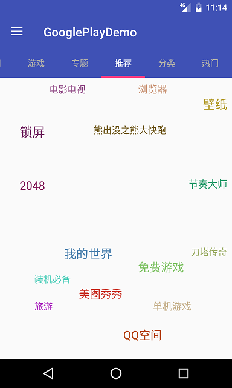

## 加载数据 ##
	public interface Api {
	
	    @GET("recommend")
	    Call<List<String>> listRecommend();
	}

    @Override
    protected void startLoadData() {
        Call<List<String>> listCall = HeiMaRetrofit.getInstance().getApi().listRecommend();
        listCall.enqueue(new Callback<List<String>>() {
            @Override
            public void onResponse(Call<List<String>> call, Response<List<String>> response) {
                mDataList = response.body();
                onDataLoadedSuccess();
            }

            @Override
            public void onFailure(Call<List<String>> call, Throwable t) {
                onDataLoadedError();
            }
        });
    }

## 创建视图 ##
    @Override
    protected View onCreateContentView() {
        //创建星状图
        StellarMap stellarMap = new StellarMap(getContext());
        //设置adapter
        stellarMap.setAdapter(new RecommendAdapter(getContext(), mData));
        int padding = getResources().getDimensionPixelSize(R.dimen.padding);
        //设置星状图内部padding
        stellarMap.setInnerPadding(padding, padding, padding, padding);
        //设置布局网格15*20，越大分布越平均
        stellarMap.setRegularity(15, 20);
        //设置初始化组
        stellarMap.setGroup(0, false);
        return stellarMap;
    }

## 创建StellarMap.Adapter ##
    /**
     * 返回组(页面)的个数
     */
    @Override
    public int getGroupCount() {
        int pageCount = mDataList.size() / PAGE_SIZE;
        if (mDataList.size() % PAGE_SIZE != 0) {//有余数的时候
            pageCount++;
        }
        return pageCount;
    }

    /**
     * 返回对应组(页面)条目的个数
     */
    @Override
    public int getCount(int group) {
        if (mDataList.size() % PAGE_SIZE != 0) {//有余数
            if (group == getGroupCount() - 1) {//最后一组
                return mDataList.size() % PAGE_SIZE;
            }
        }
        return PAGE_SIZE;
    }

    /**
     * 返回对应组中对应位置的view
     *
     * @param convertView 回收的view
     */
    @Override
    public View getView(int group, int position, View convertView) {
        TextView tv;
        if (convertView == null) {
            tv = new TextView(mContext);
        } else {
            tv = (TextView) convertView;
        }
        int index = group * PAGE_SIZE + position;
        String data = mDataList.get(index);
        tv.setText(data);
        //随机大小
        Random random = new Random();
        tv.setTextSize(random.nextInt(4) + 14);//14-18
        //随机颜色
        int alpha = 255;
        int red = random.nextInt(190) + 30;//30-220
        int green = random.nextInt(190) + 30;//30-220
        int blue = random.nextInt(190) + 30;//30-220
        int argb = Color.argb(alpha, red, green, blue);
        tv.setTextColor(argb);
        return tv;
    }

    /**
     * 返回放大或者缩小下一组的下标
     *
     * @param group 当前组的下标
     * @param isZoomIn true表示放大，false表示缩小
     */
    @Override
    public int getNextGroupOnZoom(int group, boolean isZoomIn) {
        if (isZoomIn) {
            return (group + 1) % getGroupCount();
        } else {
            return (group - 1 + getGroupCount()) % getGroupCount();
        }
    }

## StellarMap原理 ##
StellarMap内部维护两个RandomLayout, 一个显示，一个隐藏。RandomLayout随机分散摆放里面的子控件。StellarMap同时监听用户手势来动画切换两个RandomLayout。
### RandomLayout的基本原理 ###
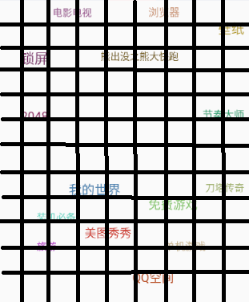

通过调用`stellarMap.setRegularity(15, 20);`将RandomLayout划分成很多的小方格，在布局子控件时，随机选取一个小方格摆放，如果小方格已经有控件摆放或者摆放时跟其他的控件发生重叠
则再随机选取一个小方格摆放，直到找到合适的位置。

# BaseListFragment抽取 #
## 共性 ##
### 布局 ###
由于首页，应用，游戏，专题，分类都是List的形式，所以可以抽取一个ListView。

### 点击监听 ###
    mListView.setOnItemClickListener(mOnItemClickListener);

### ListView的头 ###
    if (header != null) {
        mListView.addHeaderView(header);
    }

## 特性 ##
### 不同的adpater ###
    protected abstract BaseAdapter onCreateAdapter();

### 对条目点击事件的处理 ###
    protected void onListItemClick(int i) {};

# BaseListAdapter的抽取 #
## 共性 ##
* 上下文Context
* 数据集合
* getCount
* getItem
* getItemId
* getView
* ViewHolder

## 特性 ##
* ViewHolder的创建
* ViewHolder的绑定

# 分类界面 #
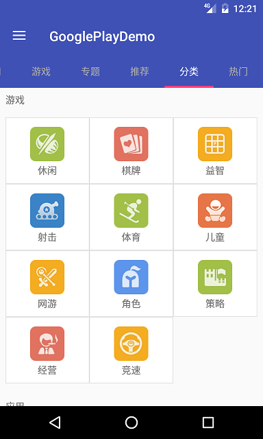

为了便于页面的扩展，分类界面显示采用ListView, 所以继承BaseListFragment。
## 加载数据 ##
    @Override
    protected void startLoadData() {
        Call<List<CategoryBean>> categories = HeiMaRetrofit.getInstance().getApi().categories();
        categories.enqueue(new Callback<List<CategoryBean>>() {
            @Override
            public void onResponse(Call<List<CategoryBean>> call, Response<List<CategoryBean>> response) {
                mCategories = response.body();
                onDataLoadedSuccess();
            }

            @Override
            public void onFailure(Call<List<CategoryBean>> call, Throwable t) {
                onDataLoadedError();
            }
        });
    }

## 创建Adapter ##
    @Override
    protected BaseAdapter onCreateAdapter() {
        return new CategoryListAdapter(getContext(), mCategories);
    }

## CategoryItemView ##
分类界面列表的每个条目为CategoryItemView，它由一个标题（TextView）和一个网格布局（TableLayout）组成，根据数据动态地向网格中添加视图。其他网格布局还可以是GridView, RecyclerView加GridLayoutMananger, GridLayout。这里根据网络返回的数据结构选择TableLayout。

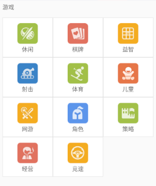

    public void bindView(CategoryBean item) {
        mTitle.setText(item.getTitle());
        mTableLayout.removeAllViews();
        int widthPixels = getResources().getDisplayMetrics().widthPixels - mTableLayout.getPaddingLeft() - mTableLayout.getPaddingRight() ;
        int itemWidth = widthPixels / 3;
        TableRow.LayoutParams layoutParams = new TableRow.LayoutParams();
        layoutParams.width = itemWidth;//每个子条目的宽度
        List<CategoryBean.InfosBean> infos = item.getInfos();
        for (int i = 0; i < infos.size(); i++) {
            TableRow tableRow = new TableRow(getContext());
            CategoryInfoItemView infoItemView1 = new CategoryInfoItemView(getContext());
            infoItemView1.setLayoutParams(layoutParams);
            infoItemView1.bindView(infos.get(i).getName1(), infos.get(i).getUrl1());
            tableRow.addView(infoItemView1);

            CategoryInfoItemView infoItemView2 = new CategoryInfoItemView(getContext());
            infoItemView2.setLayoutParams(layoutParams);
            infoItemView2.bindView(infos.get(i).getName2(), infos.get(i).getUrl2());
            tableRow.addView(infoItemView2);

            String name3 = infos.get(i).getName3();
            if ( name3 != null && name3.length() > 0) {
                CategoryInfoItemView infoItemView3 = new CategoryInfoItemView(getContext());
                infoItemView3.setLayoutParams(layoutParams);
                infoItemView3.bindView(infos.get(i).getName3(), infos.get(i).getUrl3());
                tableRow.addView(infoItemView3);
            }
            mTableLayout.addView(tableRow);
        }
    }

## CategoryInfoItemView ##
CategoryInfoItemView为CategoryItemView中一个子条目的视图。

### 加载图片 ###
	//图片url
    public static final String URL_IMAGE = HOST + "image?name=";
	//添加Glide依赖
    compile 'com.github.bumptech.glide:glide:3.7.0'

# BaseLoadMoreListFragment的抽取 #
## 共性 ##
首页，应用，游戏，专题都能够滚动到底部加载更多，都显示一个加载进度条。

    @Override
    protected void initListView() {
        super.initListView();
        getListView().setOnScrollListener(new AbsListView.OnScrollListener() {
            @Override
            public void onScrollStateChanged(AbsListView view, int scrollState) {
                if (scrollState == SCROLL_STATE_IDLE) {
                    if (view.getLastVisiblePosition() == getLoadMorePosition()) {
                        onStartLoadMore();
                    }
                }
            }

            @Override
            public void onScroll(AbsListView view, int firstVisibleItem, int visibleItemCount, int totalItemCount) {

            }
        });
    }

## 特性 ##
加载更多数据的实现

    protected abstract void onStartLoadMore();

# BaseLoadMoreListAdapter的抽取 #

## 共性 ##
* getCount（由于多了一个进度条，个数要加1）
* getViewTypeCount（返回item类型的个数）
* getItemViewType （有两种类型的item, 一种是普通的item，一种是进度条）
* onCreateViewHolder
* onBindViewHolder
* 加载更多进度条 （LoadingMoreProgressView）

## 特性 ##
子类实现普通item的ViewHolder的创建和绑定

* onCreateNormalViewHolder
* onBindNormalViewHolder

## LoadingMoreProgressView ##

# 专题界面 #

## 加载数据 ##
    @Override
    protected void startLoadData() {
        Call<List<SubjectBean>> listCall = HeiMaRetrofit.getInstance().getApi().listSubject(0);
        listCall.enqueue(new Callback<List<SubjectBean>>() {
            @Override
            public void onResponse(Call<List<SubjectBean>> call, Response<List<SubjectBean>> response) {
                mSubjects.addAll(response.body());
                onDataLoadedSuccess();
            }

            @Override
            public void onFailure(Call<List<SubjectBean>> call, Throwable t) {
                onDataLoadedError();
            }
        });
    }

## 创建Adapter ##
    @Override
    protected BaseAdapter onCreateAdapter() {
        return new SubjectListAdapter(getContext(), mSubjects);
    }

## 加载更多数据 ##
    @Override
    protected void onStartLoadMore() {
        Call<List<SubjectBean>> listCall = HeiMaRetrofit.getInstance().getApi().listSubject(mSubjects.size());
        listCall.enqueue(new Callback<List<SubjectBean>>() {
            @Override
            public void onResponse(Call<List<SubjectBean>> call, Response<List<SubjectBean>> response) {
                mSubjects.addAll(response.body());
                getAdapter().notifyDataSetChanged();
            }

            @Override
            public void onFailure(Call<List<SubjectBean>> call, Throwable t) {
            }
        });
    }

# BaseAppListFragment的抽取 #
除了首页多了一个轮播图外，首页，应用，游戏界面具有相同的app的列表，所以抽取一个BaseAppListFragment。
## 共性 ##
### 数据列表 ###
    List<AppListItem> mAppListItems = new ArrayList<AppListItem>();

### 相同的Adapter ###
    @Override
    protected BaseAdapter onCreateAdapter() {
       return new AppListAdapter(getContext(), mAppListItems);
    }

### 相同的item的点击事件 ###
    @Override
    protected void onListItemClick(int i) {
        Intent intent = new Intent(getContext(), AppDetailActivity.class);
        intent.putExtra("package_name", getAppList().get(i).getPackageName());
        startActivity(intent);
    }

# AppListAdapter的抽取 #

## onCreateNormalItemViewHolder ##
    @Override
    protected ViewHolder onCreateNormalItemViewHolder() {
        return new ViewHolder(new AppListItemView(getContext()));
    }

## onBindNormalViewHolder ##
    @Override
    protected void onBindNormalViewHolder(ViewHolder viewHolder, int position) {
        ((AppListItemView)(viewHolder.holdView)).bindView(getDataList().get(position));
    }

## AppListItemView ##

### CircleDownloadView ###
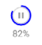

# 游戏页面 #
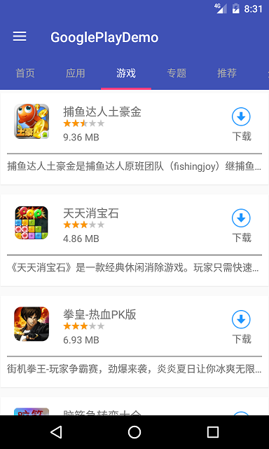
## 加载数据 ##
    @Override
    protected void startLoadData() {
        getAppList().clear();
        Call<List<AppListItem>> listCall = HeiMaRetrofit.getInstance().getApi().listGames(0);
        listCall.enqueue(new Callback<List<AppListItem>>() {
            @Override
            public void onResponse(Call<List<AppListItem>> call, Response<List<AppListItem>> response) {
                getAppList().addAll(response.body());
                onDataLoadedSuccess();
            }

            @Override
            public void onFailure(Call<List<AppListItem>> call, Throwable t) {
                onDataLoadedError();
            }
        });
    }

## 加载更多数据 ##
    @Override
    protected void onStartLoadMore() {
        Call<List<AppListItem>> listCall = HeiMaRetrofit.getInstance().getApi().listGames(mAppListItems.size());
        listCall.enqueue(new Callback<List<AppListItem>>() {
            @Override
            public void onResponse(Call<List<AppListItem>> call, Response<List<AppListItem>> response) {
                getAppList().addAll(response.body());
                getAdapter().notifyDataSetChanged();
            }

            @Override
            public void onFailure(Call<List<AppListItem>> call, Throwable t) {

            }
        });
    }

# 应用页面 #
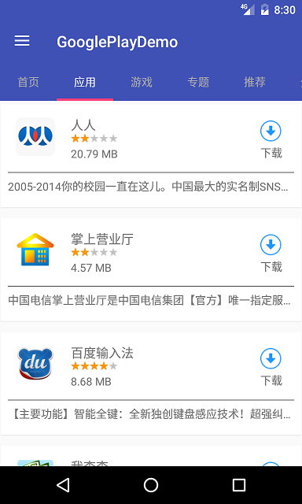
## 加载数据 ##
    @Override
    protected void startLoadData() {
        getAppList().clear();
        Call<List<AppListItem>> listCall = HeiMaRetrofit.getInstance().getApi().listApps(0);
        listCall.enqueue(new Callback<List<AppListItem>>() {
            @Override
            public void onResponse(Call<List<AppListItem>> call, Response<List<AppListItem>> response) {
                getAppList().addAll(response.body());
                onDataLoadedSuccess();
            }

            @Override
            public void onFailure(Call<List<AppListItem>> call, Throwable t) {
                onDataLoadedError();
            }
        });
    }

## 加载更多数据 ##
    @Override
    protected void onStartLoadMore() {
        Call<List<AppListItem>> listCall = HeiMaRetrofit.getInstance().getApi().listApps(getAppList().size());
        listCall.enqueue(new Callback<List<AppListItem>>() {
            @Override
            public void onResponse(Call<List<AppListItem>> call, Response<List<AppListItem>> response) {
                getAppList().addAll(response.body());
                getAdapter().notifyDataSetChanged();
            }

            @Override
            public void onFailure(Call<List<AppListItem>> call, Throwable t) {

            }
        });
    }

# 首页页面 #

## 加载数据 ##
    @Override
    protected void startLoadData() {
        mLooperDataList.clear();
        getAppList().clear();
        Call<HomeBean> listCall = HeiMaRetrofit.getInstance().getApi().listHome(0);
        listCall.enqueue(new Callback<HomeBean>() {
            @Override
            public void onResponse(Call<HomeBean> call, Response<HomeBean> response) {
                getAppList().addAll(response.body().getList());
                mLooperDataList.addAll(response.body().getPicture());
                onDataLoadedSuccess();
            }

            @Override
            public void onFailure(Call<HomeBean> call, Throwable t) {
                onDataLoadedError();
            }
        });
    }

## 加载更多数据 ##
    @Override
    protected void onStartLoadMore() {
        Call<HomeBean> listCall = HeiMaRetrofit.getInstance().getApi().listHome(getAppList().size());
        listCall.enqueue(new Callback<HomeBean>() {
            @Override
            public void onResponse(Call<HomeBean> call, Response<HomeBean> response) {
                getAppList().addAll(response.body().getList());
                getAdapter().notifyDataSetChanged();
            }

            @Override
            public void onFailure(Call<HomeBean> call, Throwable t) {
            }
        });
    }

## 添加轮播图 ##

### 集成FunBanner ###
	//项目build.gradle
	allprojects {
	    repositories {
	        maven { url 'https://jitpack.io' }
	    }
	}
	//app模块build.gradle
    compile 'com.github.uncleleonfan:funbanner:1.0.2'

### 初始化FunBanner ###

    @Override
    protected View onCreateHeaderView() {
        FunBanner banner = new FunBanner(getContext());
        //设置图片的宽高比
        banner.setRatio(0.377f);
        //设置自动轮播
        banner.setEnableAutoLoop(true);
        banner.setImageUrlHost(Constant.URL_IMAGE);
        banner.setImageUrls(mLooperDataList);
        return banner;
    }

### 调整加载更多时的位置 ###
    @Override
    protected int getLoadMorePosition() {
        return getAdapter().getCount();
    }

### 调整item点击的位置 ###
    /**
     * 处理item的点击事件，由于多加了一个头，获取点击位置的数据时下标减1      
     */
    @Override
    protected void onListItemClick(int i) {
        Intent intent = new Intent(getContext(), AppDetailActivity.class);
        intent.putExtra("package_name", getAppList().get(i-1).getPackageName());
        startActivity(intent);
    }

# 应用详情页面 #

## AppDetailActivity ##
### 初始化ActionBar ###
    private void initActionBar() {
        setSupportActionBar(mToolbar);
        ActionBar actionBar = getSupportActionBar();
        actionBar.setTitle("应用详情");
        actionBar.setDisplayHomeAsUpEnabled(true);
    }

### 配置状态条颜色 ###
    private void setStatusBarColor() {
        if (Build.VERSION.SDK_INT >= Build.VERSION_CODES.LOLLIPOP) {
            Window window = getWindow();
            window.addFlags(WindowManager.LayoutParams.FLAG_DRAWS_SYSTEM_BAR_BACKGROUNDS);
            window.setStatusBarColor(getResources().getColor(R.color.colorPrimaryDark));
        }
    }
### 返回按钮 ###
    @Override
    public boolean onOptionsItemSelected(MenuItem item) {
        switch (item.getItemId()) {
            case android.R.id.home:
                finish();
                break;
        }
        return super.onOptionsItemSelected(item);
    }

## AppDetailFragment ##
### 加载数据 ###
    @Override
    protected void startLoadData() {
        mPackageName = getActivity().getIntent().getStringExtra("package_name");
        Call<AppDetailBean> appDetailBeanCall = HeiMaRetrofit.getInstance().getApi().appDetail(mPackageName);
        appDetailBeanCall.enqueue(new Callback<AppDetailBean>() {
            @Override
            public void onResponse(Call<AppDetailBean> call, Response<AppDetailBean> response) {
                mAppDetailBean = response.body();
                onDataLoadedSuccess();
            }

            @Override
            public void onFailure(Call<AppDetailBean> call, Throwable t) {
                onDataLoadedError();
            }
        });
    }

### 应用信息 AppDetailInfoView ###
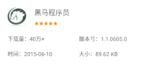

### 应用安全 AppDetailSecurityView ###

#### 绑定视图 ####
    public void bindView(AppDetailBean appDetailBean) {
        for (int i = 0; i < appDetailBean.getSafe().size(); i++) {
            AppDetailBean.SafeBean safeBean = appDetailBean.getSafe().get(i);
            //Add tag
            ImageView tag = new ImageView(getContext());
            mAppDetailSecurityTags.addView(tag);
            Glide.with(getContext())
                    .load(Constant.URL_IMAGE + safeBean.getSafeUrl())
                    .override(Target.SIZE_ORIGINAL, Target.SIZE_ORIGINAL)
                    .into(tag);

            //Add one line description
            LinearLayout line = new LinearLayout(getContext());
            ImageView ivDes = new ImageView(getContext());
            TextView tvDes = new TextView(getContext());
            tvDes.setText(safeBean.getSafeDes());
            if (safeBean.getSafeDesColor() == 0) {
                tvDes.setTextColor(getResources().getColor(R.color.app_detail_safe_normal));
            } else {
                tvDes.setTextColor(getResources().getColor(R.color.app_detail_safe_warning));
            }

            line.addView(ivDes);
            Glide.with(getContext())
                    .load(Constant.URL_IMAGE + safeBean.getSafeDesUrl())
                    .override(Target.SIZE_ORIGINAL, Target.SIZE_ORIGINAL)
                    .into(ivDes);
            line.addView(tvDes);

            mAppDetailSecurityDes.addView(line);
            collapseAppDetailSecurity();
        }
    }
#### 打开或者关闭 ####
    private void toggleSecurityInfo() {
        if (securityInfoOpen) {
            //关闭
            int measuredHeight = mAppDetailSecurityDes.getMeasuredHeight();
            animateViewHeight(mAppDetailSecurityDes, measuredHeight, 0);
            //箭头顺时针旋转180度
            ObjectAnimator objectAnimator = ObjectAnimator.ofFloat(mAppDetailSecurityArrow, "rotation", -180, 0);
            objectAnimator.start();

        } else {
            //打开
            //测量模式为UNSPECIFIED
            mAppDetailSecurityDes.measure(0, 0);
            //获取mAppDetailSecurityDes完全展开应该有的高度
            int measuredHeight = mAppDetailSecurityDes.getMeasuredHeight();
            animateViewHeight(mAppDetailSecurityDes, 0, measuredHeight);
            //箭头逆时针旋转180度
            ObjectAnimator objectAnimator = ObjectAnimator.ofFloat(mAppDetailSecurityArrow, "rotation", 0, -180);
            objectAnimator.start();
        }
        securityInfoOpen = !securityInfoOpen;
    }
###  应用截图 AppDetailGalleryView ###

#### 绑定视图 ####

    public void bindView(AppDetailBean appDetailBean) {
        for (int i = 0; i < appDetailBean.getScreen().size(); i++) {
            String screen = appDetailBean.getScreen().get(i);
            ImageView imageView = new ImageView(getContext());
            int padding = getResources().getDimensionPixelSize(R.dimen.app_detail_pic_padding);
            if (i != appDetailBean.getScreen().size() - 1) {
                imageView.setPadding(0, 0, padding, 0);
            }
            Glide.with(getContext()).load(Constant.URL_IMAGE + screen).override(Target.SIZE_ORIGINAL, Target.SIZE_ORIGINAL).into(imageView);
            mAppDetailPicContainer.addView(imageView);
        }
    }

### 应用描述 AppDetailDesView ###
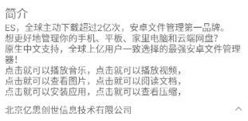
#### 绑定视图 ####
    public void bindView(AppDetailBean appDetailBean) {
        mAppDetailAuthor.setText(appDetailBean.getAuthor());
        mAppDetailDes.setText(appDetailBean.getDes());
        mAppDetailDes.getViewTreeObserver().addOnGlobalLayoutListener(new ViewTreeObserver.OnGlobalLayoutListener() {
            @Override
            public void onGlobalLayout() {
                mAppDetailDes.getViewTreeObserver().removeGlobalOnLayoutListener(this);
                //保存全部展开后的大小
                mAppDetailDesOriginHeight = mAppDetailDes.getHeight();
                //设置初始显示7行
                mAppDetailDes.setLines(7);
            }
        });
    }

#### 打开或者关闭 ####

    private void toggleDescription() {
        if (descriptionOpen) {
            //关闭
            mAppDetailDes.setLines(7);
            //获取7行时的高度
            mAppDetailDes.measure(0, 0);
            int measuredHeight = mAppDetailDes.getMeasuredHeight();
            //动画从原始高度到7行高度
            animateViewHeight(mAppDetailDes, mAppDetailDesOriginHeight, measuredHeight);
            //箭头逆时针旋转180度
            ObjectAnimator objectAnimator = ObjectAnimator.ofFloat(mAppDetailDesArrow, "rotation", -180, 0);
            objectAnimator.start();

        } else {
            //打开
            //从7行高度到原始高度
            int measuredHeight = mAppDetailDes.getMeasuredHeight();
            animateViewHeight(mAppDetailDes, measuredHeight, mAppDetailDesOriginHeight);
            //箭头顺时针旋转180度
            ObjectAnimator objectAnimator = ObjectAnimator.ofFloat(mAppDetailDesArrow, "rotation", 0, -180);
            objectAnimator.start();
        }
        descriptionOpen = !descriptionOpen;
    }
### 底部下载条 AppDetailBottomBar ###
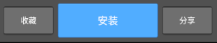
#### 自定义控件ProgressButton ####

    @Override
    protected void onDraw(Canvas canvas) {
        //是否绘制进度
        if (enableProgress) {
            //根据进度计算出drawable的右边位置
            int right = (int) ((mProgress / mMax) * getWidth());
            mDrawable.setBounds(0, 0, right, getHeight());
            //将drawable绘制到画布上
            mDrawable.draw(canvas);
        }
        super.onDraw(canvas);
    }

# 应用下载 #
## DownloadManager ##
DownloadManger完成对应用下载的管理，使用单例模式。

	public class DownloadManager{

	    public static DownloadManager getInstance() {
	        if (sDownloadManager == null) {
	            synchronized (DownloadManager.class) {
	                if (sDownloadManager == null) {
	                    sDownloadManager = new DownloadManager();
	                }
	            }
	        }
	        return sDownloadManager;
	    }
	}

## 创建APK存放目录 ##

    //下载apk的存放路径，当应用被卸载时，该路径下的文件也会被删除
    private static final String DOWNLOAD_DIRECTORY = Environment.getExternalStorageDirectory()
		 + "/Android/data/包名/apk/";

    public void createDownloadDirectory() {
        File directoryFile = new File(DOWNLOAD_DIRECTORY);
        if (!directoryFile.exists()) {
            directoryFile.mkdirs();
        }
    }

	//由于需要在磁盘上创建目录，在Android6.0上需要动态申请权限，我们在MainActivity检查权限。
    private void checkStoragePermission() {
        int result = ActivityCompat.checkSelfPermission(this, Manifest.permission.WRITE_EXTERNAL_STORAGE);
        if (result == PackageManager.PERMISSION_DENIED) {
            String[] permissions = {Manifest.permission.WRITE_EXTERNAL_STORAGE};
            ActivityCompat.requestPermissions(this, permissions, 0);
        }
    }

## 下载数据结构 DownloadInfo##
由于下载一个app的过程中会产成很多数据，包括下载app的名字，下载的进度，下载的状态等，这里构建一个描述下载一个app的数据结构。
	
	public class DownloadInfo {
	    private String packageName;
	    private String downloadUrl;
	    private String filePath;
	    private int downloadStatus = DownloadManager.STATE_UN_DOWNLOAD;
	    private Runnable downloadTask;
	    private int size;
	    private long progress;
	}

## 下载状态 ##
    public static final int STATE_UN_DOWNLOAD = 0;//未下载
    public static final int STATE_DOWNLOADING = 1;//下载中
    public static final int STATE_PAUSE = 2;//暂停下载
    public static final int STATE_WAITING = 3;//等待下载
    public static final int STATE_FAILED = 4;//下载失败
    public static final int STATE_DOWNLOADED = 5;//下载完成
    public static final int STATE_INSTALLED = 6;//已安装

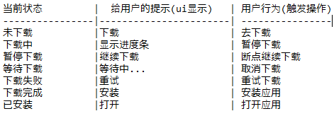

## 初始化DownloadInfo ##
    /**
     * 初始化下载信息
     */
    public DownloadInfo initDownloadInfo(Context context, String packageName, int size, String downloadUrl) {
        //如果已经初始化过对应包名的下载信息，则直接返回
        if (mDownloadInfoMap.get(packageName) != null) {
            return mDownloadInfoMap.get(packageName);
        }
        DownloadInfo downloadInfo = new DownloadInfo();
        downloadInfo.setPackageName(packageName);
        downloadInfo.setSize(size);
        downloadInfo.setDownloadUrl(downloadUrl);

        if (isInstalled(context, packageName)) {
            downloadInfo.setDownloadStatus(STATE_INSTALLED);
        } else if (isDownloaded(downloadInfo)) {
            downloadInfo.setDownloadStatus(STATE_DOWNLOADED);
        } else {
            downloadInfo.setDownloadStatus(STATE_UN_DOWNLOAD);
        }
        //保存下载信息
        mDownloadInfoMap.put(downloadInfo.getPackageName(), downloadInfo);
        return downloadInfo;
    }

    }

## 是否安装 ##

    private boolean isInstalled(Context context, String packageName) {
        try {
            context.getPackageManager().getPackageInfo(packageName, PackageManager.GET_ACTIVITIES);
            return true;
        } catch (PackageManager.NameNotFoundException e) {
            e.printStackTrace();
            return false;
        }
    }

## 打开App ##

    private void openApp(Context context, DownloadInfo downloadInfo) {
        Intent intent = context.getPackageManager().getLaunchIntentForPackage(downloadInfo.getPackageName());
        context.startActivity(intent);
    }

## 是否已下载 ##

    private boolean isDownloaded(DownloadInfo downloadInfo) {
        String filePath = DOWNLOAD_DIRECTORY + downloadInfo.getPackageName() + ".apk";
        downloadInfo.setFilePath(filePath);
        File file = new File(filePath);
        if (file.exists()) {
            if (file.length() == downloadInfo.getSize()) {
                return true;
            } else {
                //记录已经下载了多少
                downloadInfo.setProgress(file.length());
                return false;
            }
        }
        return false;
    }

## 安装App ##
    /**
     * 安装apk, 在模拟器上可能失败，模拟器如果是x86而应用不支持
     * 
     * D/InstallAppProgress: Installation error code: -113
     * http://grepcode.com/file/repository.grepcode.com/java/ext/com.google.android/android
     * /5.1.1_r1/android/content/pm/PackageManager.java#PackageManager.0INSTALL_FAILED_INVALID_APK
     * 
     * public static final int INSTALL_FAILED_NO_MATCHING_ABIS = -113;
     */
    private void installApk(Context context, DownloadInfo downloadInfo) {
        File file = new File(downloadInfo.getFilePath());
        if (file.exists()) {
            Intent intent = new Intent(Intent.ACTION_VIEW);
            intent.setDataAndType(Uri.fromFile(file), "application/vnd.android.package-archive");
            context.startActivity(intent);
        }
    }

## 下载等待 ##
当执行下载任务之前，先进入等待状态

## 下载App ##

    private class DownloadTask implements Runnable {

        private DownloadInfo mDownloadInfo;

        private DownloadTask(DownloadInfo downloadInfo) {
            mDownloadInfo = downloadInfo;
        }

        @Override
        public void run() {
            InputStream inputStream = null;
            FileOutputStream fileOutputStream = null;
            try {
                File file = new File(mDownloadInfo.getFilePath());
                if (!file.exists()) {
                    file.createNewFile();//如果文件不存在，则创建文件
                }
                //获取下载apk的url,传入当前下载进度，用作断点续传
                String url = URLUtils.getDownloadURL(mDownloadInfo.getDownloadUrl(), mDownloadInfo.getProgress());
                Request request = new Request.Builder().url(url).get().build();
                //同步请求
                Response response = mOkHttpClient.newCall(request).execute();
                if (response.isSuccessful()) {
                    inputStream = response.body().byteStream();
                    fileOutputStream = new FileOutputStream(file, true);//往文件后面写数据
                    byte[] buffer = new byte[1024];
                    int len = -1;
                    while ((len = inputStream.read(buffer)) != -1) {
                        //如果下载的状态变为暂停，跳出循环
                        if (mDownloadInfo.getDownloadStatus() == STATE_PAUSE) {
                            return;
                        }
                        fileOutputStream.write(buffer, 0, len);
                        //更新下载进度
                        long progress = mDownloadInfo.getProgress() + len;
                        mDownloadInfo.setProgress(progress);
                        updateStatus(STATE_DOWNLOADING);
                        //下载完成跳出循环
                        if (progress == mDownloadInfo.getSize()) {
                            break;
                        }
                    }
                    //更新状态已下载
                    updateStatus(STATE_DOWNLOADED);

                } else {
                    //更新状态下载失败
                    updateStatus(STATE_FAILED);
                }
            } catch (IOException e) {
                e.printStackTrace();
                //更新状态下载失败
                updateStatus(STATE_FAILED);
				.......
            }
        }
    }

## 通知更新进度 ##
下载进度的通知我们采用观察者模式实现

### 观察者模式 ###
* Observable (被观察者)
* Observer （被观察者）
	
		public class Teacher extends Observable {
		
		    public void publishMessage(String msg) {
		        setChanged();
		        notifyObservers(msg);
		    }
		}

		public class Student implements Observer {
		
		    @Override
		    public void update(Observable o, Object arg) {
		        System.out.print(arg + "\n");
		    }
		}

	    @Test
	    public void testObserverPattern() {
	        Student student1 = new Student();
	        Student student2 = new Student();
	        Teacher teacher = new Teacher();
	        teacher.addObserver(student1);
	        teacher.addObserver(student2);
	        teacher.publishMessage("放假不解释");
	    }

### 被观察者DownloadManager ###
    //DownloadManager作为被观察者，保存DownloadManager的观察者
	//一个应用的包名对应一个观察者（也可以设计成对应多个观察者）
    //一个应用的下载状态就会通知对应的观察者
    private Map<String, Observer> mDownloadObservers = new HashMap<String, Observer>();

    /**
     * 添加观察者
     */
    public void addObserver(String packageName, Observer observer) {
        mDownloadObservers.put(packageName, observer);
    }

    /**
     * 移除观察者
     */
    public void removeObserver(String packageName) {
        mDownloadObservers.remove(packageName);
    }

    /**
     * 通知观察者
     */
    private void notifyObservers(DownloadInfo downloadInfo) {
        Observer observer = mDownloadObservers.get(downloadInfo.getPackageName());
        if (observer != null) {
            observer.update(null, downloadInfo);
        }
    }

### 观察者DownloadButton ###

	public class DownloadButton extends Button implements Observer{

	    @Override
	    public void update(Observable o, Object arg) {
	        final DownloadInfo downloadInfo = (DownloadInfo) arg;
	        post(new Runnable() {
	            @Override
	            public void run() {
	                updateStatus(downloadInfo);
	            }
	        });
	    }
	}

## 暂停下载 ##
暂停下载只需设置下载状态为STATE_PAUSE，在下载任务while循环中判断是否为暂停状态，如果是则跳出循环。

    private void pauseDownload(DownloadInfo downloadInfo) {
        downloadInfo.setDownloadStatus(STATE_PAUSE);
        notifyObservers(downloadInfo);
    }

    //如果下载的状态变为暂停，跳出循环
    if (mDownloadInfo.getDownloadStatus() == STATE_PAUSE) {
        return;
    }

## 继续下载 ##
继续下载只需重新执行以下下载即可。

    case DownloadManager.STATE_PAUSE:
         download(downloadInfo);
         break;

# 多线程下载 #

##线程运行机制
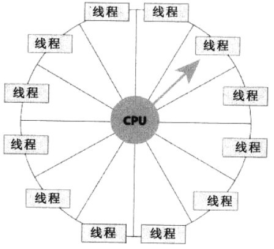

* 单核cpu，同一时刻只能处理一个线程，多核cpu同一时刻可以处理多个线程
* 操作系统为每个运行线程安排一定的CPU时间----`时间片`，系统通过一种循环的方式为线程提供时间片，线程在自己的时间内运行，因为时间相当短，多个线程频繁地发生切换，因此给用户的感觉就是好像多个线程同时运行一样。

## 线程池 ##
Android中耗时的操作，都会开子线程，线程的创建和销毁是要消耗系统资源的。为了减少频繁的线程的创建和销毁带来的不必要的开销，可以使用线程池。
线程池的优点：

* 重用线程池中的线程,减少因对象创建,销毁所带来的性能开销;

* 能有效的控制线程的最大并发数,提高系统资源利用率,同时避免过多的资源竞争,避免堵塞;

* 能够多线程进行简单的管理,使线程的使用简单、高效。

线程池的应用非常广泛，在众多的开源框架中也总能看到线程池的踪影。

## 线程池涉及的类
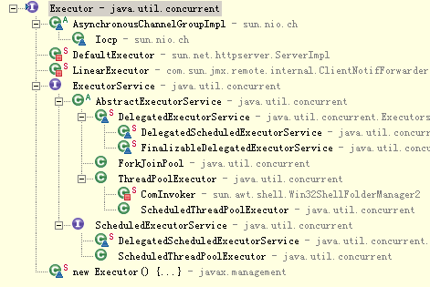

* Executor:Java里面线程池的顶级接口。
* ExecutorService:真正的线程池接口。
* ScheduledExecutorService:能和Timer/TimerTask类似，解决那些需要任务重复执行的问题。
* ThreadPoolExecutor(重点):ExecutorService的默认实现。
* ScheduledThreadPoolExecutor:继承ThreadPoolExecutor的ScheduledExecutorService接口实现，周期性任务调度的类实现。
* Executors:可以一行代码创建一些常见的线程池。

## ThreadPoolExecutor介绍 ##
	//构造方法
	public ThreadPoolExecutor(int corePoolSize，//核心池的大小
	                              int maximumPoolSize，//线程池最大线程数
	                              long keepAliveTime，//保持时间
	                              TimeUnit unit，//时间单位
	                              BlockingQueue<Runnable> workQueue，//任务队列
	                              ThreadFactory threadFactory，//线程工厂
	                              RejectedExecutionHandler handler) //异常的捕捉器
###构造相关参数解释
* corePoolSize：`核心池的大小`，这个参数跟后面讲述的线程池的实现原理有非常大的关系。在创建了线程池后，默认情况下，线程池中并没有任何线程，而是等待有任务到来才创建线程去执行任务，除非调用了prestartAllCoreThreads()或者prestartCoreThread()方法，从这2个方法的名字就可以看出，是预创建线程的意思，即在没有任务到来之前就创建corePoolSize个线程或者一个线程。默认情况下，在创建了线程池后，线程池中的线程数为0，当有任务来之后，就会创建一个线程去执行任务，当线程池中的线程数目达到corePoolSize后，就会把到达的任务放到缓存队列当中；
* maximumPoolSize：`线程池最大线程数`，这个参数也是一个非常重要的参数，它表示在线程池中最多能创建多少个线程；
* keepAliveTime：`表示线程没有任务执行时最多保持多久时间会终止`。默认情况下，只有当线程池中的线程数大于corePoolSize时，keepAliveTime才会起作用，直到线程池中的线程数不大于corePoolSize，即当线程池中的线程数大于corePoolSize时，如果一个线程空闲的时间达到keepAliveTime，则会终止，直到线程池中的线程数不超过corePoolSize。但是如果调用了allowCoreThreadTimeOut(boolean)方法，在线程池中的线程数不大于corePoolSize时，keepAliveTime参数也会起作用，直到线程池中的线程数为0；
* unit：参数keepAliveTime的`时间单位`，有7种取值

		TimeUnit.DAYS;               //天
		TimeUnit.HOURS;             //小时
		TimeUnit.MINUTES;           //分钟
		TimeUnit.SECONDS;           //秒
		TimeUnit.MILLISECONDS;      //毫秒
		TimeUnit.MICROSECONDS;      //微妙
		TimeUnit.NANOSECONDS;       //纳秒
* workQueue ： `任务队列`，是一个阻塞队列，用来存储等待执行的任务，这个参数的选择也很重要，会对线程池的运行过程产生重大影响，参考BlockingQueue

		ArrayBlockingQueue;
		LinkedBlockingQueue;
		SynchronousQueue;
* threadFactory : `线程工厂`，如何去创建线程的
* handler ： 任务队列添加`异常的捕捉器`，参考 RejectedExecutionHandler
		
		ThreadPoolExecutor.AbortPolicy:丢弃任务并抛出RejectedExecutionException异常。 
		ThreadPoolExecutor.DiscardPolicy：也是丢弃任务，但是不抛出异常。 
		ThreadPoolExecutor.DiscardOldestPolicy：丢弃队列最前面的任务，然后重新尝试执行任务（重复此过程）
		ThreadPoolExecutor.CallerRunsPolicy：由调用线程处理该任务 

###基础API的介绍
* isShutdown() ： 判断线程池是否关闭
* isTerminated() : 判断线程池中任务是否执行完成
* shutdown() : 调用后不再接收新任务，如果里面有任务，就执行完
* shutdownNow() : 调用后不再接受新任务，如果有等待任务，移出队列；有正在执行的，尝试停止之
* submit() : 提交执行任务
* execute() : 执行任务

###任务提交给线程池之后的处理策略
1. 如果当前线程池中的线程数目小于corePoolSize，则每来一个任务，就会创建执行这个任务；
2. 如果当前线程池中的线程数目>=corePoolSize，则每来一个任务，会尝试将其添加到任务缓存队列当中
	1. 若添加成功，则该任务会等待空闲线程将其取出去执行；
	2. 若添加失败（一般来说是任务缓存队列已满，针对的是有界队列），则会尝试创建新的线程去执行这个任务；
3. 如果当前线程池中的线程数目达到maximumPoolSize，则会采取任务拒绝策略进行处理；
4. 如果线程池中的线程数量大于 corePoolSize时，如果某线程空闲时间超过keepAliveTime，线程将被终止，直至线程池中的线程数目不大于corePoolSize；如果允许为核心池中的线程设置存活时间，那么核心池中的线程空闲时间超过keepAliveTime，线程也会被终止。

###任务提交给线程池之后的处理策略（比喻）
假如有一个工厂，工厂里面有10(`corePoolSize`)个工人，每个工人同时只能做一件任务。因此只要当10个工人中有工人是空闲的，`来了任务就分配`给空闲的工人做；
当10个工人都有任务在做时，如果还来了任务，就把任务进行排队等待(`任务队列`)；如果说新任务数目增长的速度远远大于工人做任务的速度，那么此时工厂主管可能会想补救措施，比如重新招4个临时工人(`创建新线程`)进来；然后就将任务也分配给这4个临时工人做；
如果说着14个工人做任务的速度还是不够，此时工厂主管可能就要考虑不再接收新的任务或者抛弃前面的一些任务了(`拒绝执行`)。
当这14个工人当中有人空闲时，而且空闲超过一定时间(`空闲时间`)，新任务增长的速度又比较缓慢，工厂主管可能就考虑辞掉4个临时工了，只保持原来的10个工人，毕竟请额外的工人是要花钱的

## 阻塞队列的介绍（BlockingQueue）
阻塞队列，如果BlockingQueue是空的，从BlockingQueue取东西的操作将会被阻断进入等待状态，直到BlockingQueue进了东西才会被唤醒，同样，如果BlockingQueue是满的，任何试图往里存东西的操作也会被阻断进入等待状态，直到BlockingQueue里有空间时才会被唤醒继续操作。

1. 基础API介绍
	* 往队列中加元素的方法
		* add(E) : 非阻塞方法， 把元素加到BlockingQueue里，如果BlockingQueue可以容纳，则返回true，否则抛出异常。
		* offer(E) : 非阻塞， 表示如果可能的话，将元素加到BlockingQueue里，即如果BlockingQueue可以容纳，则返回true，否则返回false。
		* put(E)：阻塞方法， 把元素加到BlockingQueue里，如果BlockingQueue没有空间，则调用此方法的线程被阻断直到BlockingQueue里有空间再继续。
	
	* 从队列中取元素的方法
		* poll(time)： 阻塞方法，取走BlockingQueue里排在首位的元素，若不能立即取出，则可以等time参数规定的时间，取不到时返回null。
		* take()：取走BlockingQueue里排在首位的对象，若BlockingQueue为空，阻断进入等待状态直到BlockingQueue有新的对象被加入为止。

2. 子类介绍
	* `ArrayBlockingQueue(有界队列)`： FIFO 队列，规定大小的BlockingQueue，其构造函数必须带一个int参数来指明其大小
	
	* `LinkedBlockingQueue(无界队列)`：FIFO 队列，大小不定的BlockingQueue，若其构造函数带一个规定大小的参数，生成的BlockingQueue有大小限制，若不带大小参数，所生成的BlockingQueue的大小由Integer.MAX_VALUE来决定。

	* `PriorityBlockingQueue`：优先级队列， 类似于LinkedBlockingQueue，但队列中元素非 FIFO， 依据对象的自然排序顺序或者是构造函数所带的Comparator决定的顺序

	* `SynchronousQueue(直接提交策略)`: 交替队列，`队列中操作时必须是先放进去，接着取出来`，交替着去处理元素的添加和移除，这是一个很有意思的阻塞队列，其中每个插入操作必须等待另一个线程的移除操作，同样任何一个移除操作都等待另一个线程的插入操作。因此此队列内部其 实没有任何一个元素，或者说容量是0，严格说并不是一种容器。由于队列没有容量，因此不能调用peek操作，因为只有移除元素时才有元素。
 
## RejectedExecutionHandler介绍
###实现的子类介绍

* ThreadPoolExecutor.AbortPolicy 
	>当添加任务出错时的策略捕获器，如果出现错误，则直接`抛出异常`

* ThreadPoolExecutor.CallerRunsPolicy
	> 当添加任务出错时的策略捕获器，如果出现错误，`直接执行`加入的任务

* ThreadPoolExecutor.DiscardOldestPolicy
	> 当添加任务出错时的策略捕获器，如果出现错误，`移除第一个任务，执行加入的任务`

* ThreadPoolExecutor.DiscardPolicy
	> 当添加任务出错时的策略捕获器，如果出现错误，`不做处理`

## Executors ##
帮助我们方便的生成一些常用的线程池，ThreadPoolExecutor是Executors类的底层实现

### newSingleThreadExecutor ###
创建一个单线程的线程池。这个线程池只有一个线程在工作，也就是相当于单线程串行执行所有任务。如果这个唯一的线程因为异常结束，那么会有一个新的线程来替代它。此线程池>保证所有任务的执行顺序按照任务的提交顺序执行。

### newFixedThreadPool ###
创建固定大小的线程池。每次提交一个任务就创建一个线程，直到线程达到线程池的最大大小。线程池的大小一旦达到最大值就会保持不变，如果某个线程因为执行异常而结束，那么线程池会补充一个新线程。

### newCachedThreadPool ###
创建一个可缓存的线程池。如果线程池的大小超过了处理任务所需要的线程，那么就会回收部分空闲（60秒不执行任务）的线程，当任务数增加时，此线程池又可以智能的添加新线程来处理任务。此线程池不会对线程池大小做限制，线程池大小完全依赖于操作系统（或者说JVM）能够创建的最大线程大小。

### newScheduledThreadPool###
创建一个大小无限的线程池。此线程池支持定时以及周期性执行任务的需求。

## 线程池代理 ##

### 代理模式 ###
其实每个模式名称就表明了该模式的作用，代理模式就是多一个代理类出来，替原对象进行一些操作，比如我们在租房子的时候回去找中介，为什么呢？因为你对该地区房屋的信息掌握的不够全面，希望找一个更熟悉的人去帮你做，此处的代理就是这个意思。
再如我们有的时候打官司，我们需要请律师，因为律师在法律方面有专长，可以替我们进行操作，表达我们的想法

代理模式的应用场景：

如果已有的方法在使用的时候需要对原有的方法进行改进，此时有两种办法：

1、修改原有的方法来适应。这样违反了“对扩展开放，对修改关闭”的原则。

2、采用一个代理类调用原有的方法，且对产生的结果进行控制。这种方法就是代理模式。

使用代理模式，可以将功能划分的更加清晰，有助于后期维护！

>开闭原则：软件系统中包含的各种组件，例如模块（Modules）、类（Classes）以及功能（Functions）等等，
>应该在不修改现有代码的基础上，引入新功能。开闭原则中“开”，是指对于组件功能的扩展是开放的，是允许对其进行功能扩展的；
>开闭原则中“闭”，是指对于原有代码的修改是封闭的，即修改原有的代码对外部的使用是透明的。举例:DownloadButton

### 线程池代理 ###
	
    private ThreadPoolProxy() {
        long keepAliveTime = 3000;
        TimeUnit unit = TimeUnit.MILLISECONDS;
        BlockingQueue<Runnable> workQueue = new LinkedBlockingDeque<Runnable>();
        ThreadFactory threadFactory = Executors.defaultThreadFactory();
        RejectedExecutionHandler handler = new ThreadPoolExecutor.DiscardPolicy();
        mThreadPoolExecutor = new ThreadPoolExecutor(DEFAULT_CORE_POOL_SIZE, DEFAULT_MAXIMUM_POOL_SIZE, keepAliveTime, unit, workQueue, threadFactory, handler);
        //上述代码基本等价于
        ExecutorService executorService = Executors.newFixedThreadPool(5);
    }

    /**
     * 执行任务
     */
    public void execute(Runnable task) {
        mThreadPoolExecutor.execute(task);
    }

    /**
     * 移除任务
     */
    public void remove(Runnable task) {
        mThreadPoolExecutor.remove(task);
    }

## 取消下载 ##
    private void cancelDownload(DownloadInfo downloadInfo) {
        ThreadPoolProxy.getInstance().remove(downloadInfo.getDownloadTask());
        downloadInfo.setDownloadStatus(STATE_UN_DOWNLOAD);
        notifyObservers(downloadInfo);
    }

# CircleDownloadView的实现 #

## 同步状态
    public void syncState(AppListItem item) {
        //由于ListView回收的影响，如果mDownloadInfo不为空则表示CircleDownload之前监听过其他app的下载
        if (mDownloadInfo != null) {
            //移除之前的监听
            DownloadManager.getInstance().removeObserver(mDownloadInfo.getPackageName());
        }
        mDownloadInfo = DownloadManager.getInstance().initDownloadInfo(getContext(), item.getPackageName(), item.getSize(), item.getDownloadUrl());
        //添加新的监听
		DownloadManager.getInstance().addObserver(mDownloadInfo.getPackageName(), this);
        updateStatus(mDownloadInfo);
    }

## 更新状态 ##

    private void updateStatus(DownloadInfo downloadInfo) {
        //移除掉原来的observer之后，还有一些残余的runnable没有执行，将残余的更新过滤掉
        if (!downloadInfo.getPackageName().equals(mDownloadInfo.getPackageName())) {
            return;
        }
        mDownloadInfo = downloadInfo;
		.....

    }

## 初始化圆形进度条的矩形 ##
    @Override
    protected void onSizeChanged(int w, int h, int oldw, int oldh) {
        mRectF.left = mIcon.getLeft() - 3;
        mRectF.top = mIcon.getTop() - 3;
        mRectF.right = mIcon.getRight() + 3;
        mRectF.bottom = mIcon.getBottom() + 3;
        mRectF.set(left, top, right, bottom);

    }

## 绘制 ##

    //一般情况下自定义的ViewGroup不会绘制自己，除非给它设置背景，所以我们打开绘制自定义ViewGroup的开关
   	setWillNotDraw(false);

    @Override
    protected void onDraw(Canvas canvas) {
        if (enableProgress) {
            float sweepAngle = (mDownloadInfo.getProgress() * 1.0f / mDownloadInfo.getSize()) * 360;
            canvas.drawArc(mRectF, -90, sweepAngle, false, mPaint);
        }
    }

# 缓存 #
## Why? ##
缓存的目的减少服务器负荷，降低延迟提升用户体验。复杂的缓存策略会根据用户当前的网络情况采取不同的缓存策略，比如在2g网络很差的情况下，提高缓存使用的时间；
不用的应用、业务需求、接口所需要的缓存策略也会不一样，有的要保证数据的实时性，所以不能有缓存，有的你可以缓存5分钟，等等。你要根据具体情况所需数据的时效性情况给出不同的方案。

## What? ##
* 内存缓存：通俗的讲就是一个类中的成员变量 （例如LruCache）
* 磁盘缓存：以文件的形式存储在磁盘上 (例如 DiskLruCache)

## How？ ##
### Cache-Controll ###
Cache-Control 是最重要的规则。这个字段用于指定所有缓存机制在整个请求/响应链中必须服从的指令。缓存指令是单向的，即请求中存在一个指令并不意味着响应中将存在同一个指令。

* [Header Field Definitions](https://www.w3.org/Protocols/rfc2616/rfc2616-sec14.html)
### 配置OKhttp的缓存目录 ###
    public void init(Context context) {
		//指定缓存路径
        String directoryPath = context.getCacheDir().getAbsolutePath() + "/responses";
        File directory = new File(directoryPath);
        OkHttpClient okHttpClient = new OkHttpClient.Builder()
                .cache(new Cache(directory, DEFAULT_CACHE_SIZE))//指定缓存目录和大小
                .addInterceptor(new LoggingInterceptor())//拦截器，打印请求头和响应头
                .addNetworkInterceptor(REWRITE_CACHE_CONTROL_INTERCEPTOR)
                .build();
        Retrofit retrofit = new Retrofit.Builder()
                .baseUrl(Constant.HOST)
                .client(okHttpClient)
                .addConverterFactory(GsonConverterFactory.create(gson))
                .build();
        mApi = retrofit.create(Api.class);
    }

### 重写网络响应的Cache-Control ###
如果服务器在网络响应头里配置了Cache-Contorol，那么其实客户端是不需要做任何事情就能使用缓存的，但如果服务器没有配置，我们可以拦截这个网络响应，加入我们自己的配置。

    /**
     * Dangerous interceptor that rewrites the server's cache-control header.
     */
    private static final Interceptor REWRITE_CACHE_CONTROL_INTERCEPTOR = new Interceptor() {
        @Override
        public Response intercept(Interceptor.Chain chain) throws IOException {
            Response originalResponse = chain.proceed(chain.request());
            //设置5分钟后缓存过期
            CacheControl.Builder builder = new CacheControl.Builder().maxAge(5, TimeUnit.MINUTES);
            return originalResponse.newBuilder()
                    .header(CACHE_CONTROL, builder.build().toString())
                    .build();
        }
    };

> [OKhttp Intercepter](https://github.com/square/okhttp/wiki/Interceptors)

